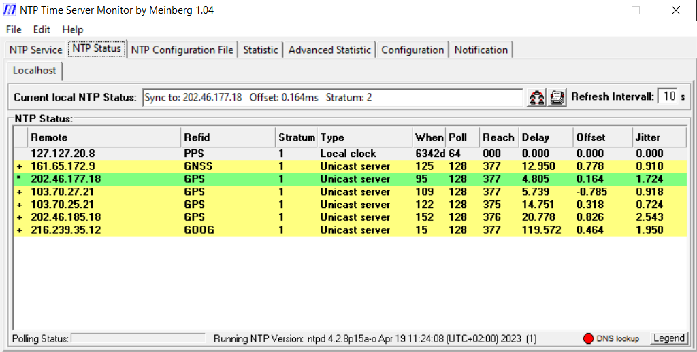

# Getting Started with NTP

This guide covers what to check after running the installer to confirm NTP is working correctly, how to read the key diagnostic displays, and what to do if something looks wrong.


---

## 1. Open NTP Time Server Monitor

NTP Time Server Monitor is included with the Meinberg NTP installation and provides a graphical view of the NTP service status, peer connections, and system timing state — no command line needed.

**To open it:**
- Press **Win + S** and type **NTP Time Server Monitor**, or
- Navigate to **Start → All Programs → Meinberg → NTP → NTP Time Server Monitor**.

The monitor will auto-detect the local NTP service on startup. The main tab to use is **NTP Status**. The other tabs available are:

| Tab | Contents |
|-----|----------|
| **NTP Service** | Service start/stop controls |
| **NTP Status** | Peer table and sync summary — the main view |
| **NTP Configuration File** | View and edit ntp.conf directly |
| **Statistic** | Basic polling statistics |
| **Advanced Statistic** | Extended timing statistics |
| **Configuration** | TSM application settings |
| **Notification** | Alert configuration |

Below the main tabs, a **Localhost** sub-tab represents the local NTP service.

---

## 2. Check the NTP service is running

### In NTP Time Server Monitor

When the monitor connects to the local NTP daemon, the **NTP Status** tab populates with your configured sources. If the table is empty and the status bar shows a connection error, the NTP service is not running.

To start it, double-click the **Restart NTP** shortcut on the Desktop (created by the installer). Then press **F5** in NTP Time Server Monitor to refresh.

> If the desktop shortcut is not available, see [Appendix: Command-line reference](#appendix-command-line-reference) for manual service commands.

---

## 3. Wait for NTP to settle

**Checking initial connection (2–3 minutes):** After the NTP service starts, wait just 2–3 minutes and then open the **NTP Status** tab. You should see your configured servers beginning to appear with non-zero Reach values. This is enough to confirm that NTP is running, connecting to servers, and polling correctly — you do not need to wait longer to verify the configuration is working.

**Full settling (1–2 hours):** For accurate, stable timekeeping, NTP needs more time:

- **First lock**: allow 5–15 minutes for the service to begin correcting the clock.
- **Stable operation**: allow 1–2 hours for offsets and jitter to reach their long-term values. The drift file accumulates calibration data over this period. It can take up to 24 hours to fully stabilise, so leave the system running for a day if possible.

Do not judge NTP timing accuracy in the first few minutes after a restart.

---

## 4. View the peer table

The peer table shows the current state of all configured time sources.

### In NTP Time Server Monitor

Click the **NTP Status** tab. It looks like this:



The top of the window shows a one-line summary:

> **Current local NTP Status:** Sync to: 202.46.177.18 &nbsp; Offset: 0.164ms &nbsp; Stratum: 2

This tells you at a glance which server your clock is synced to, the current offset, and your stratum level.

Below that is the peer table. Each row is one time source, and rows are **colour-coded**: green = currently selected source (`*`); yellow = acceptable alternate (`+`).

| Column | Meaning |
|--------|---------|
| *(marker)* | Status symbol — see table below |
| Remote | IP address or hostname of the time source |
| Refid | What that server uses as its own reference (`GPS`, `GNSS`, `PPS`, `GOOG`, etc.) |
| Stratum | Distance from primary reference. 1 = GPS/atomic, 2 = synced to stratum 1, etc. |
| Type | `Unicast server` = internet NTP server; `Local clock` = local GPS/PPS driver |
| When | Seconds since last poll |
| Poll | Current polling interval in seconds |
| Reach | Reachability register. `377` = all 8 recent polls succeeded; `000` = unreachable |
| Delay | Round-trip network delay to this server (ms) |
| Offset | Time difference between your clock and this server (ms) |
| Jitter | Variability of recent offset measurements (ms) |

#### Status markers

| Symbol | Meaning |
|--------|---------|
| `*` | Currently selected (best) source |
| `+` | Acceptable alternate source |
| `-` | Discarded by the cluster algorithm |
| `x` | Declared a falseticker (too far from others) |
| `o` | PPS source currently selected (best possible — GPS PPS lock) |
| ` ` (blank) | Not yet usable or rejected |

**What to look for:**
- At least one row shows `*` (selected source).
- Reach of `377` on your primary server — all 8 recent polls succeeded.
- Offset within ±20 ms on internet sources is normal. Well below ±1 ms for a good GPS NMEA source.
- Jitter below 5 ms on internet sources. Below 1 ms for GPS.

### Command-line alternative

Run from the Meinberg NTP `bin` folder (usually `C:\Program Files (x86)\NTP\bin\`):

```
ntpq -p
```

Example output:

```
     remote           refid      st t when poll reach   delay   offset  jitter
==============================================================================
*ntp.nmi.gov.au  .GPS.            1 u   34   64  377    8.234    0.412   0.189
+0.au.pool.ntp.. 193.79.237.14    2 u   21   64  377   21.456    1.203   0.451
 LOCAL(0)        .LOCL.          10 l    -   64    0    0.000    0.000   0.001
```

The columns are the same as the Peers tab above. The status marker appears as the first character of the `remote` column.

---

## 5. Check clock state

### In NTP Time Server Monitor

The one-line summary bar at the top of the **NTP Status** tab gives the key values:

| Value | Meaning |
|-------|---------|
| **Sync to** | IP or hostname of the currently selected time source |
| **Offset** | Current clock offset in ms — should be small and stable |
| **Stratum** | Your PC's current stratum (2 or lower with internet servers; 1 if GPS-disciplined) |

For deeper detail (frequency correction, jitter, dispersion), use the command-line alternative below.

### Command-line alternative

```
ntpq -c rv
```

---

## 6. Check the log files

Log files are written to the stats directory (default: `C:\Program Files (x86)\NTP\etc\`).

### loopstats

Records the clock discipline state at each correction:

```
60000 86400.123 0.000412 -18.234 0.000189 0.000021 4
```

Columns: MJD, time-of-day (s), offset (s), frequency (ppm), RMS jitter (s), wander (ppm), clock discipline code.

- **offset**: should be small and stable (< 0.001 s = 1 ms for internet, < 0.0001 s for GPS NMEA).
- **frequency**: should converge to a stable value as the drift file accumulates data (typically within a day).

### peerstats

Records each poll to each server:

```
60000 86400.456 192.168.1.1 9714 0.008234 0.000412 0.000189 0.000021
```

Columns: MJD, time-of-day (s), server IP, status flags, delay (s), offset (s), RMS dispersion (s), jitter (s).

---

## 7. GPS NMEA-only: adjusting the USB delay (time2)

If you installed a GPS receiver in NMEA-only mode, the GPS source offset in the peer table will initially be large (50–150 ms) due to USB serial propagation delay. This must be corrected manually:

1. Wait until NTP has polled the GPS source and Reach shows `377` (check the **NTP Status** tab in NTP Time Server Monitor, or run `ntpq -p`).
2. Note the Offset value shown for the GPS source row (e.g. `+120.4` ms).
3. Edit `ntp.conf` (default: `C:\Program Files (x86)\NTP\etc\ntp.conf`).
4. Find the `fudge` line for your GPS COM port, e.g.:
   ```
   fudge 127.127.20.3 flag1 0 flag2 0 refid NMEA
   ```
5. Add `time2` set to the **negative** of the observed offset in seconds:
   ```
   fudge 127.127.20.3 time2 -0.120 flag1 0 flag2 0 refid NMEA
   ```
6. Restart the NTP service using the **Restart NTP** shortcut on the Desktop.
7. After settling, recheck the offset. Repeat until the GPS source offset is near zero (< ±5 ms).

---

## 8. GPS PPS: confirming PPS lock

For GPS PPS + NMEA setups, check the **NTP Status** tab in NTP Time Server Monitor (or run `ntpq -p`):

- The GPS source row should show the `o` marker once PPS lock is established.
- Ref ID should show `GPS`.
- Offset for the PPS source should be very small — typically < 0.1 ms.
- PPS lock requires the GPS receiver to have satellite fix. This can take several minutes after power-on in a new location.

If the GPS row shows `*` (not `o`), PPS is not yet locked — NTP is using the NMEA time but not the PPS pulse. This is normal while acquiring lock.

---

## 9. Common problems

| Symptom | Likely cause | Fix |
|---------|-------------|-----|
| Peer list empty / connection error in TSM | NTP service not running | Use the **Restart NTP** desktop shortcut, then press F5 in TSM |
| `reach` never reaches `377` | Firewall blocking UDP 123 | Allow UDP port 123 outbound in Windows Firewall |
| Large offset on internet sources (> 100 ms) | Clock was far out before first sync | Wait; NTP will step-correct if offset > 128 ms |
| GPS row always blank | Wrong COM port or baud rate in ntp.conf | Re-run Step 3 of the installer |
| GPS offset > 100 ms | USB delay not calibrated | Set `time2` fudge as described in section 7 |
| GPS row shows `*` not `o` | PPS not locked (no satellite fix or DLL issue) | Confirm GPS has sky view and satellite lock |
| `frequency` > ±500 ppm | No drift file yet or bad oscillator | Allow 24 hours for drift file to accumulate |
| NTP service fails to start | ntp.conf syntax error | Check ntp.conf manually; look at Windows Event Log |

---

## 10. Ongoing monitoring

Once NTP is stable, normal operation requires no regular attention. However, for occultation timing work, check before an observing session using **NTP Time Server Monitor**:

- **NTP Status** tab shows `*` (green row) on your preferred source with Reach = `377`.
- Offset on your primary source is within your required accuracy window.
- The monitor connects without error (NTP service is running).
- Log files are being written (check timestamp on loopstats in `C:\Program Files (x86)\NTP\etc\`).

See [Appendix: Command-line reference](#appendix-command-line-reference) if you prefer command-line tools.

---

## Appendix: Command-line reference

The following commands are available from an **Administrator command prompt**. They cover the same operations as NTP Time Server Monitor and the desktop shortcuts, and are useful for scripting or troubleshooting without a GUI.

### Check if the NTP service is running

```
sc query NTP
```

Look for `STATE : 4  RUNNING`. If it shows `STOPPED`, start it with the **Restart NTP** desktop shortcut or the command below.

### Start the NTP service

```
net start NTP
```

### Stop the NTP service

```
net stop NTP
```

### Restart the NTP service

```
net stop NTP
net start NTP
```

### View the peer table

Run from the Meinberg NTP `bin` folder (usually `C:\Program Files (x86)\NTP\bin\`):

```
ntpq -p
```

Output columns match the NTP Status tab — see [section 4](#4-view-the-peer-table) for column descriptions.

### View detailed system variables

```
ntpq -c rv
```

Key variables:

| Variable | Meaning |
|----------|---------|
| `stratum` | Your PC's current stratum |
| `offset` | Current clock offset in ms |
| `frequency` | Clock frequency correction in ppm. Normal range ±200 ppm. |
| `sys_jitter` | System clock jitter in ms |
| `rootdelay` | Total one-way delay to the primary reference |
| `rootdisp` | Total dispersion — accumulated uncertainty |
